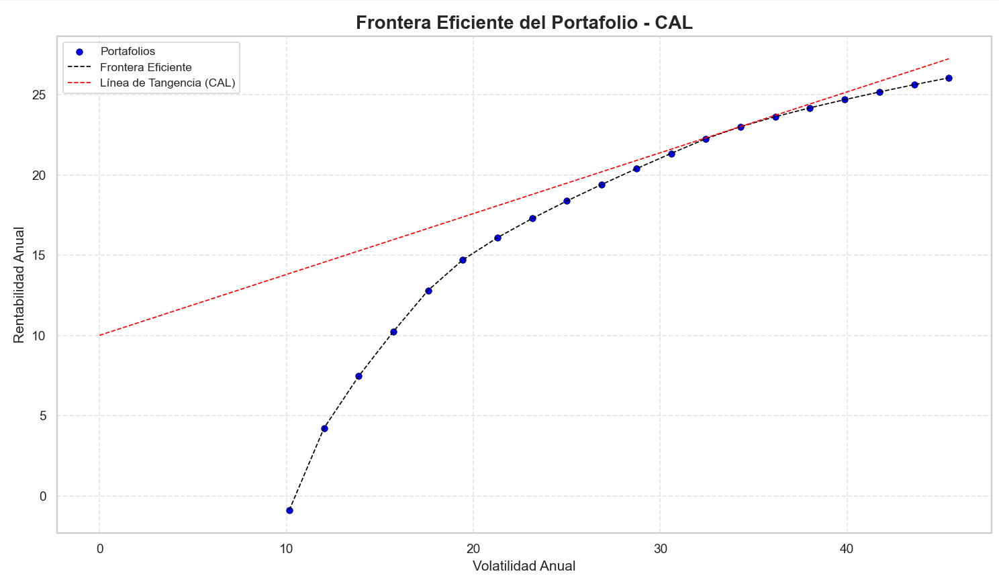

# 🧠 Estrategia Óptima de Inversión: Construcción de Portafolio Eficiente con ETL en Python

## 📌 Introducción

Como inversionistas, enfrentamos dos preguntas fundamentales:

1. ¿En qué activos invertir?
2. ¿Cómo distribuir nuestro capital en estos activos?

Este proyecto aborda la **segunda pregunta**, aplicando la teoría de portafolios eficientes de **Harry Markowitz** para construir un portafolio óptimo basado en datos reales del mercado.
Se desarrolló un flujo completo **ETL (Extract, Transform, Load)** usando programación orientada a objetos (POO), integrando consultas a **APIs financieras**, y estructurando un pipeline reutilizable y escalable.

---

## ⚙️ Descripción del Proyecto

El propósito de este proyecto es generar un **portafolio de inversión eficiente**, basándonos en datos históricos de precios de activos financieros. Para ello:

* 🔗 Se consultaron datos mediante **APIs públicas de mercado** (como Yahoo Finance, entre otras).
* 🧠 Se construyó un pipeline **ETL avanzado** que:

  * **Extrae** información histórica de precios.
  * **Transforma** los datos para calcular rendimientos, varianzas, covarianzas y simulaciones.
  * **Carga** los datos en estructuras listas para análisis financiero y visualización.

---

## 🧰 Herramientas y Tecnologías

* **Python 3.10+**
* **Programación Orientada a Objetos (POO)**
* **pandas**, **numpy**, **matplotlib**, **seaborn**
* **APIs financieras** vía \[`yfinance`]
* **Jupyter Notebook** para exploración de datos

---

## 🧱 Arquitectura del ETL

```plaintext
┌────────────┐       ┌──────────────┐       ┌──────────────┐
│ Extracción │──────▶│ Transformación │──────▶│     Carga     │
└────────────┘       └──────────────┘       └──────────────┘
     ▲ API               ▲ Cálculos POO         ▲ Visualización
     │                   │ Financiera           │ & Análisis
     ▼                   ▼                      ▼
yfinance API       Rendimientos,            Gráficas de
                   Volatilidad,             Portafolio
                   Simulaciones
```

---

## 📊 Resultados Visuales

### 📈 Frontera Eficiente de Markowitz 📉 Línea de Asignación de Capital (CAL)

La CAL ilustra la combinación óptima entre un activo libre de riesgo y el portafolio riesgoso óptimo, maximizando el rendimiento por unidad de riesgo a través del **Sharpe Ratio**.

<!-- Pega aquí la imagen de la CAL -->



---

## 💡 Principales Características

* ✅ **POO Modular**: Clases reutilizables para cada componente del ETL.
* ✅ **Automatización Total**: Desde la extracción de datos hasta el gráfico final.
* ✅ **Simulación de Múltiples Portafolios** con restricciones de pesos.
* ✅ **Análisis Cuantitativo**: Cálculo del ratio de Sharpe, matrices de covarianza y optimización del portafolio.

---

## 📁 Estructura del Repositorio

```bash
.
├── notebooks/
│   ├── yahoo_finance_data.ipynb  # Exploración de data yahoo finance
│   ├── alphavantage_data.ipynb   # Exploración de data alphavantage
├── data/                    # Datos descargados y temporales
├── orchestration/
│   ├── etl_yahoo.py 
│   ├── numerical_methods.py 
│   ├── orchestrate.py 
├── requirements.txt
└── README.md
```

---

## 🚀 Cómo Ejecutarlo

1. Clona el repositorio:

```bash
git clone 
```

2. Instala las dependencias:

```bash
pip install -r requirements.txt
```

3. Ejecuta el pipeline:

```bash
python orchestrate.py
```

O explora los resultados desde el notebook:

```bash
jupyter notebook notebooks/yahoo_finance_data.ipynb
```

---

## 📌 Conclusión

Este proyecto demuestra cómo aplicar técnicas profesionales de ETL y análisis financiero cuantitativo para responder a una de las preguntas más críticas en inversiones: **cómo distribuir el capital eficientemente**.
Aprovechando datos reales y herramientas modernas en Python, se construyó un flujo robusto, modular y fácilmente ampliable para evaluar estrategias de inversión racionales y basadas en datos.

---

